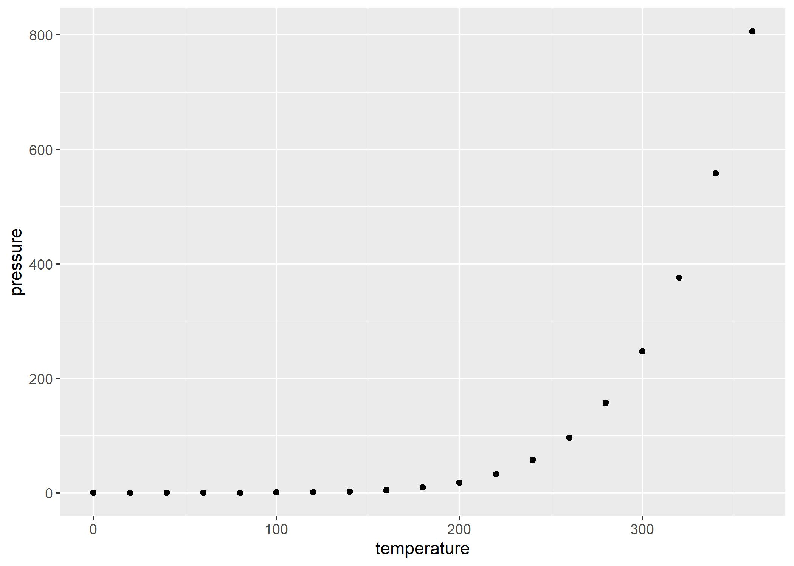

```{r setup, include=FALSE}
knitr::opts_chunk$set(echo = TRUE, 
                      message = FALSE, 
                      warning = FALSE,
                      fig.width = 7,
                      fig.height = 5)
```


```{r packages, echo=FALSE}
# install.packages("tidyverse")
library(tidyverse)
```


# Data

## Write

```{r}
pressure
write.csv(x = pressure, 
          file = "Data/pressure_data.csv")
```

The correlation between temperature and pressure is `r round(cor(pressure$temperature, pressure$pressure), digits = 2) `.

## Read

```{r}
pressure_data <- 
read.csv(file = "Data/pressure_data.csv",
         header = TRUE, 
         sep = ",",
         dec = ".")
pressure_data

getwd()
```


# Heading 1

```{r}
a <- 2
b <- 3
```

The sum of `r a` and `r b` is `r a + b`.

## Heading 2


### Heading 3

This is an R Markdown document. Markdown is a simple formatting syntax for authoring HTML, PDF, and MS Word documents. For more details on using R Markdown see <http://rmarkdown.rstudio.com>.

When you click the **Knit** button a document will be generated that includes both content as well as the output of any embedded R code chunks within the document. You can embed an R code chunk like this:

```{r cars}
summary(cars)
```

## Including Plots

You can also embed plots, for example:

```{r pressure, echo=FALSE}
ggplot(data = pressure) +
  geom_point(aes(x = temperature, y = pressure))
  

ggsave(filename = "Figures/pressure_plot.jpg")
```

Note that the `echo = FALSE` parameter was added to the code chunk to prevent printing of the R code that generated the plot.

## External plot

```{r}

```

